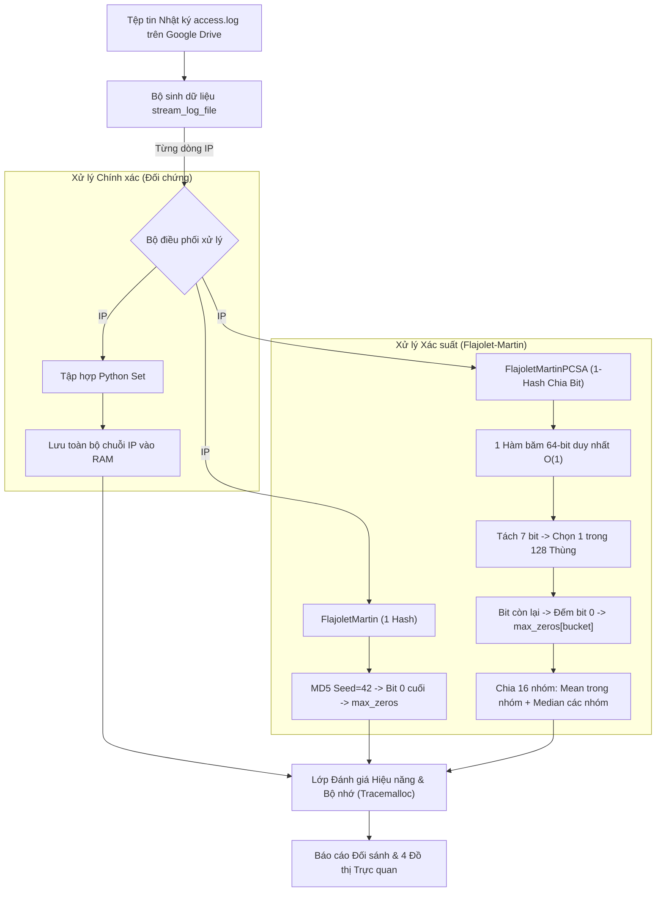
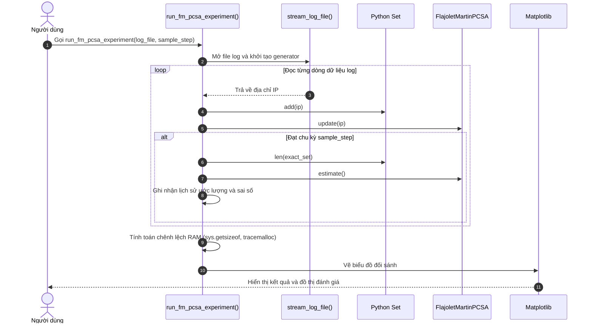
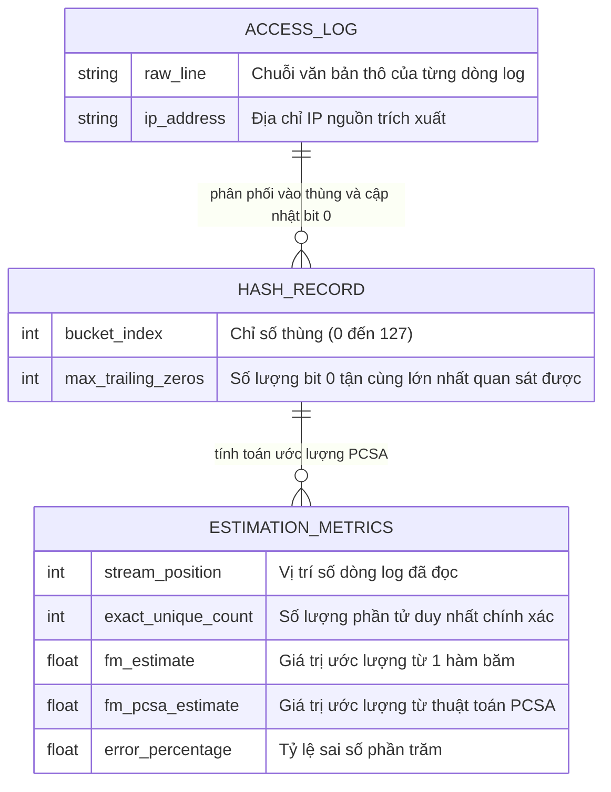

# Kiến Trúc Hệ Thống (System Architecture)

## 1. Tổng quan hệ thống (System Overview)
Hệ thống được thiết kế nhằm xử lý bài toán khai phá dữ liệu dòng lớn (Big Data Stream Mining), cụ thể là ước lượng số lượng phần tử phân biệt (Cardinality Estimation / Count-Distinct Problem) từ các tệp nhật ký truy cập mạng (Web Access Logs).

Trong các hệ thống lớn với hàng triệu tới hàng tỷ lượt truy cập, việc lưu trữ toàn bộ các địa chỉ IP hoặc định danh duy nhất vào các cấu trúc dữ liệu chính xác như Bảng băm (Hash Table) hoặc Tập hợp (`set` trong Python) dẫn đến tình trạng bùng nổ bộ nhớ RAM (OOM - Out of Memory). Hệ thống này hiện thực hóa thuật toán xác suất **Flajolet-Martin (FM)** và thuật toán chuẩn hóa **Flajolet-Martin PCSA (Probabilistic Counting with Stochastic Averaging)** với kỹ thuật chia nhóm và lấy trung vị (Median of Means), cho phép:
- Duy trì dung lượng bộ nhớ cố định ở mức hằng số $O(m)$ với $m$ là số lượng thùng băm (chỉ hơn 1 Kilobyte RAM).
- Đạt độ chính xác cao (sai số kiểm soát được trong khoảng kỳ vọng lý thuyết).
- Xử lý luồng trực tiếp với độ phức tạp thời gian cho mỗi phần tử đạt $O(1)$ nhờ chỉ băm 1 lần duy nhất và phân bổ thùng qua bit-shifting.

## 2. Công nghệ sử dụng (Tech Stack)
- **Ngôn ngữ lập trình:** Python 3.9+
- **Môi trường tính toán:** Google Colab, Jupyter Notebook (`ipykernel`)
- **Lưu trữ đám mây:** Google Drive (lưu trữ tệp log và các chỉ số benchmark vĩnh viễn)
- **Thư viện mật mã & băm:** `hashlib` (thuật toán MD5 làm hàm băm giả ngẫu nhiên có muối `seed`)
- **Quản lý & Giám sát bộ nhớ:** `tracemalloc`, `sys` (đo đạc kích thước bộ nhớ từng đối tượng và peak RAM)
- **Trực quan hóa dữ liệu:** `matplotlib.pyplot` (vẽ đồ thị tăng trưởng, sai số và độ chính xác)

## 3. Cấu trúc thư mục (Folder Structure)
```text
XuLyDuLieuLon/
│
├── .agents/                        # Cấu hình và quy chuẩn Agent & quy tắc hệ thống
│   └── rules/
│       └── intrucsion.md           # Hướng dẫn đồng bộ ngữ cảnh và quy chuẩn tài liệu
│
├── accessLog/                      # Thư mục chứa tập dữ liệu nhật ký máy chủ
│   └── access.log                  # Tệp dữ liệu thô (khoảng 3.5GB dữ liệu log truy cập)
│
├── docs/                           # Tài liệu kỹ thuật dự án
│   ├── architecture.md             # Kiến trúc hệ thống và phân tích luồng dữ liệu
│   ├── BAO_CAO_MON_HOC.md          # Báo cáo môn học hoàn chỉnh (theo mẫu ThS. Trần Thị Nhi)
│   ├── BaoCao.md                   # Kịch bản thuyết trình và cẩm nang vấn đáp báo cáo môn học
│   ├── GIAI_THICH_FM_PCSA.md       # Cẩm nang giải thích trực quan thuật toán FM PCSA
│   └── CHANGELOG.md                # Lịch sử thay đổi và phiên bản hệ thống
│
├── 1_Set_Exact.ipynb               # Thực nghiệm đếm chính xác bằng Set (Ground Truth)
├── 2_FM.ipynb                      # Thực nghiệm Flajolet-Martin (1 Hash)
├── 3_FM_PCSA.ipynb                 # Thực nghiệm Flajolet-Martin PCSA (1 Hash Chia Bit + Median of Means)
├── 4_KetLuan_SoSanh.ipynb          # Tổng hợp đối sánh, 4 biểu đồ và kết luận chuyên sâu
└── README.md                       # Tài liệu hướng dẫn cài đặt và sử dụng tổng quan
```

*(Lưu ý: Khi chạy trên Google Colab, thư mục kết quả đo đạc được lưu trữ vĩnh viễn trên Google Drive tại `/content/drive/MyDrive/accessLog/results/` chứa `set_metrics.json`, `fm_metrics.json`, `fm_pcsa_metrics.json`).*

## 4. Kiến trúc thành phần (Component Architecture)
Kiến trúc hệ thống được chia thành 4 phân lớp rõ ràng:
1. **Lớp Tiếp nhận Dữ liệu (Data Ingestion Layer):**
   - Hàm `stream_log_file`: Mở tệp log dưới dạng đọc tuần tự theo dòng (generator `yield`), trích xuất địa chỉ IP bằng thao tác cắt chuỗi nhanh (`split`), giảm thiểu tối đa overhead so với biểu thức chính quy (Regex).
2. **Lớp Xử lý Băm & Biến đổi Bit (Hashing & Bit-manipulation Layer):**
   - Hàm `hash_64`: Tạo mã băm 64-bit duy nhất thông qua chuỗi kết hợp `seed + data` qua MD5 với độ phức tạp $O(1)$.
   - Hàm `count_trailing_zeros`: Sử dụng phép toán thao tác bit (`bit-shift` và toán tử `&`) để đếm số bit 0 ở cuối biểu diễn nhị phân 64-bit với tốc độ tối ưu $O(1)$.
3. **Lớp Thuật toán Ước lượng (Estimation Core Algorithms):**
   - `FlajoletMartin`: Hiện thực thuật toán FM gốc với 1 hàm băm và hệ số hiệu chỉnh $\phi \approx 0.77351$.
   - `FlajoletMartinPCSA`: Hiện thực thuật toán PCSA (Probabilistic Counting with Stochastic Averaging - Flajolet & Martin 1985) với 1 hàm băm 64-bit, tách $b=7$ bit làm chỉ số thùng (bucket index) để phân phối vào 128 thùng, các bit còn lại dùng để đếm số bit 0 tận cùng. Áp dụng kỹ thuật Median of Means (chia 16 nhóm, tính Mean trong nhóm và Median giữa các nhóm) hoặc ước lượng chuẩn PCSA để loại trừ giá trị ngoại lai.
4. **Lớp Đối chuẩn & Trực quan hóa (Benchmarking & Visualization Layer):**
   - Các notebook đối chuẩn hiệu năng thực nghiệm, so sánh song song kết quả của FM và FM PCSA với cấu trúc `set` chuẩn của Python, ghi nhận dung lượng RAM thực tế qua `tracemalloc` và vẽ 4 biểu đồ trực quan trong `4_KetLuan_SoSanh.ipynb`.

## 5. Luồng dữ liệu (Data Flow)
1. Dữ liệu từ tệp `access.log` trên Google Drive được đọc từng dòng qua generator `stream_log_file`.
2. Địa chỉ IP được tách ra và đồng thời đưa vào 3 bộ xử lý:
   - `exact_set.add(ip)` (Bộ kiểm thử chính xác).
   - `fm.update(ip)` (FM 1 hash: Băm 1 lần -> Đếm bit 0 cuối -> Cập nhật `max_zeros`).
   - `fm_pcsa.update(ip)` (FM PCSA: Băm 1 lần 64-bit -> Tách 7 bit làm Bucket Index -> Đếm bit 0 cuối -> Cập nhật `max_zeros[128]`).
3. Theo từng chu kỳ mẫu (`sample_step` ví dụ 50,000 dòng):
   - Tính toán ước lượng hiện tại từ `fm.estimate()` và `fm_pcsa.estimate()`.
   - Lưu trữ lịch sử ước lượng và kích thước tập hợp thực tế.
4. Sau khi kết thúc toàn bộ luồng log:
   - Đo lường dung lượng RAM thực tế của `exact_set` so với `fm_pcsa`.
   - Tính toán tỷ lệ sai số tương đối (%) và độ chính xác (%).
   - Xuất bảng số liệu tổng kết và hiển thị các đồ thị phân tích.

## 6. Cơ chế bảo mật (Security Mechanisms)
- **Bảo mật dữ liệu nhạy cảm:** Các tệp log truy cập web có thể chứa IP của người dùng thực tế. Việc sử dụng thuật toán xác suất Flajolet-Martin đóng vai trò như một cơ chế bảo vệ quyền riêng tư một chiều (One-way Data Anonymization) vì thuật toán chỉ lưu giữ các giá trị cực đại của số bit 0 (`max_zeros`), không thể khôi phục ngược lại danh sách địa chỉ IP ban đầu.
- **Xử lý ngắt an toàn:** Bộ đọc generator đảm bảo giải phóng con trỏ tệp ngay khi hoàn tất hoặc khi có ngoại lệ, tránh rò rỉ bộ nhớ (File Descriptor Leaks).

## 7. APIs / Routes cốt lõi (Core APIs/Routes)
Vì dự án là một hệ thống tính toán khoa học dữ liệu dòng dưới dạng thư viện / script mã nguồn mở, các hàm cốt lõi đóng vai trò là giao diện lập trình nội bộ:

| Tên hàm / Phương thức | Tham số đầu vào | Đầu ra | Mục đích |
| :--- | :--- | :--- | :--- |
| `stream_log_file(file_path)` | `file_path: str` | `Generator[str]` | Đọc luồng tệp log và sinh tuần tự từng địa chỉ IP |
| `count_trailing_zeros(n)` | `n: int` (32-bit / 64-bit) | `int` | Đếm số lượng bit 0 liên tiếp ở cuối biểu diễn nhị phân ($O(1)$) |
| `hash_64(data_str, seed)` | `data_str: str, seed: int` | `int` (64-bit) | Tạo mã băm 64-bit duy nhất qua MD5 với độ phức tạp $O(1)$ |
| `FlajoletMartin.update(item)` | `item: str` | `None` | Cập nhật giá trị bit 0 đuôi lớn nhất với 1 hàm băm |
| `FlajoletMartin.estimate()` | Không có | `float` | Ước lượng số phần tử duy nhất theo công thức $(2^R)/\phi$ |
| `FlajoletMartinPCSA.update(item)` | `item: str` | `None` | Tách $b=7$ bit chọn thùng, đếm bit 0 cập nhật mảng 128 thùng ($O(1)$) |
| `FlajoletMartinPCSA.estimate()` | `method: str` | `float` | Ước lượng số phần tử bằng Median of Means hoặc PCSA chuẩn |

## 8. Sơ đồ trực quan (Visual Diagrams - Mermaid.js)

### Sơ đồ luồng kiến trúc hệ thống (High-Level Architecture)


### Sơ đồ tuần tự quy trình thực nghiệm (Sequence Diagram)


### Sơ đồ thực thể quan hệ dữ liệu (ER Diagram)

